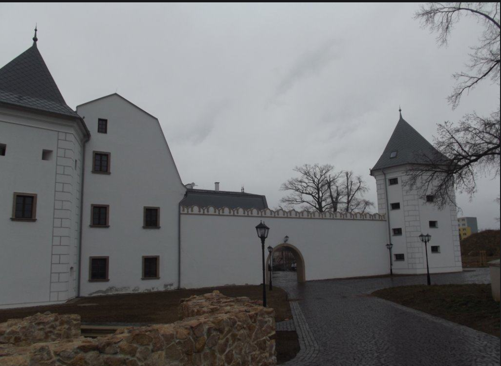

# Kaštieľ Bošany - Virtuálna prehliadka

Multiplatformová aplikácia pre kaštieľ Bošany s podporou 22 jazykov, interaktívnymi prehliadkami, historickými informáciami, galériou fotografií a videí, a gamifikačnými prvkami.



## Funkcie aplikácie

### Interaktívne prehliadky
Aplikácia obsahuje funkciu interaktívnych prehliadok, ktorá používateľom umožňuje preskúmať kaštieľ pomocou 2D a 3D animácií. Tieto prehliadky poskytujú virtuálny zážitok, pričom videoobsah z galérie je kľúčovým prvkom na lepšie prezentovanie architektúry a histórie.

### História
Sekcia venovaná histórii kaštieľa rozpráva príbehy o jeho minulosti a zaujímavostiach, podporená textovými popiskami a audiovizuálnym obsahom, ako sú historické fotografie a videá.

### Informácie o udalostiach
Používatelia majú prístup k aktuálnym informáciám o plánovaných akciách, festivaloch a prehliadkach, ktoré sa v kaštieli konajú. Tento modul zahŕňa kalendár udalostí a možnosť registrácie na akcie.

### Fotografie a videá
Aplikácia obsahuje galériu fotografií a videosúborov, ktoré ukazujú ako jeden z hlavných motívov, tak aj jednotlivé časti kaštieľa v detaile, čím sa zvyšuje atraktivita aplikácie.

### 2D a 3D animácie
Aplikácia používa kvalitné 2D a 3D animácie, ktoré používateľom umožňujú nahliadnuť do rôznych aspektov architektúry a histórie kaštieľa. Tieto animácie slúžia na zobrazenie rekonštrukcie budov, príbehov o historických osobnostiach, ktoré tam žili, a vecí, ktoré boli v minulosti súčasťou kaštieľa.

### Gamifikácia
Aplikácia zahŕňa herné prvky, ako sú odmeny za návštevu rôznych častí kaštieľa, súťaže, ktoré podporujú objavovanie a vzdelávanie, a interaktívne kvízy, ktoré umožňujú používateľom testovať svoje vedomosti o kaštieli a jeho histórii.

### Viacjazyčná podpora
Aplikácia podporuje 22 jazykov: slovenčina, čeština, angličtina, nemčina, japončina, čínština, hindčina, turečtina, ruština, francúzština, španielčina, taliančina, holandčina, portugalčina, arabčina, kórejčina, maďarčina, gréčtina, norština, finština, dánčina a švédčina.

## Technické detaily

### Webová aplikácia
- HTML5, CSS3, JavaScript
- Responzívny dizajn pre všetky zariadenia
- PWA (Progressive Web App) pre offline použitie
- Three.js pre 3D animácie
- Podpora 22 jazykov

### Mobilná aplikácia
- Natívne aplikácie pre iOS a Android
- Webview s natívnymi funkciami
- Offline režim
- Push notifikácie
- QR skener
- Rozšírená realita (AR)
- Lokalizačné služby

## Štruktúra projektu

```
Prehliadka-kastiela-Bosany/
├── assets/               # Ikony, obrázky a ďalšie assets
│   ├── flags/            # Vlajky pre jazykový prepínač
│   ├── favicon.ico       # Favicon
│   ├── icon-192x192.png  # Ikona pre PWA
│   └── icon-512x512.png  # Ikona pre PWA
├── css/                  # CSS štýly
│   └── styles.css        # Hlavný CSS súbor
├── img/                  # Obrázky kaštieľa
├── js/                   # JavaScript súbory
│   ├── app.js            # Hlavný JavaScript súbor
│   ├── quiz.js           # Kvízový modul
│   ├── quiz-data.js      # Dáta pre kvíz
│   ├── 3d-animations.js  # 3D animácie
│   └── gamification.js   # Gamifikačné prvky
├── locales/              # Jazykové súbory
│   ├── sk.json           # Slovenčina
│   ├── en.json           # Angličtina
│   └── de.json           # Nemčina (a ďalšie jazyky)
├── video/                # Video súbory
├── index.html            # Hlavná HTML stránka
├── manifest.json         # Manifest pre PWA
├── sw.js                 # Service Worker pre PWA
├── offline.html          # Offline stránka
├── mobile-app-config.json # Konfigurácia pre mobilnú aplikáciu
├── create-icons.py       # Skript na vytvorenie ikon
├── download-flags.py     # Skript na stiahnutie vlajok
└── README.md             # Dokumentácia projektu
```

## Inštalácia a spustenie

### Webová aplikácia

1. Klonujte repozitár:
   ```bash
   git clone https://github.com/valicekjan3/Prehliadka-kastiela-Bosany.git
   cd Prehliadka-kastiela-Bosany
   ```

2. Otvorte `index.html` v prehliadači alebo použite lokálny server:
   ```bash
   # Pomocou Python
   python -m http.server 8000
   
   # Alebo pomocou Node.js
   npx serve
   ```

3. Aplikácia bude dostupná na adrese `http://localhost:8000`

### Mobilná aplikácia

#### Príprava vývojového prostredia

1. Nainštalujte potrebné nástroje:
   - [Node.js](https://nodejs.org/)
   - [React Native CLI](https://reactnative.dev/docs/environment-setup)
   - [Android Studio](https://developer.android.com/studio) (pre Android)
   - [Xcode](https://developer.apple.com/xcode/) (pre iOS, len na macOS)

2. Vytvorte React Native projekt:
   ```bash
   npx react-native init KastielBosanyApp
   cd KastielBosanyApp
   ```

3. Nakonfigurujte projekt podľa `mobile-app-config.json`

4. Spustite aplikáciu:
   ```bash
   # Pre Android
   npx react-native run-android
   
   # Pre iOS
   npx react-native run-ios
   ```

## Prispievanie

1. Vytvorte fork repozitára
2. Vytvorte feature branch (`git checkout -b feature/amazing-feature`)
3. Commitnite vaše zmeny (`git commit -m 'Add some amazing feature'`)
4. Pushnite branch (`git push origin feature/amazing-feature`)
5. Otvorte Pull Request

## Licencia

Tento projekt je licencovaný pod MIT licenciou - pozrite si súbor `LICENSE` pre detaily.

## Kontakt

Ján Valíček - [jan.valicek@example.com](mailto:jan.valicek@example.com)

Project Link: [https://github.com/valicekjan3/Prehliadka-kastiela-Bosany](https://github.com/valicekjan3/Prehliadka-kastiela-Bosany)